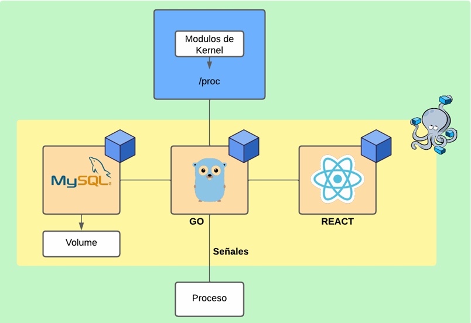

# MANUAL TÉCNICO

## Introducción

En este manual técnico, se proporcionará información detallada sobre cada uno de los componentes del sistema, incluyendo los módulos del kernel escritos en C, la aplicación en Golang para leer los datos del kernel y almacenarlos en una base de datos MySQL, la interfaz gráfica en React y la configuraciones de Docker.

## Arquitectura del sistema
 <br>
Se utilizó una maquina virtual en VirtualBox con el sistema operativo Linux Ubuntu Server 22.04, dentro de esta maquina se levantaron 3 contenedores de Docker mediante el uso de Docker Compose con las siguientes aplicaciones en cada uno:
- **Base de datos MySQL:** Guarda los datos del uso de CPU y memoria RAM para ser usados posteriormente en el monitoreo histórico. Se utilizó una sola tabla llamada *'usage_data'* con los siguientes campos:
  - **id:** identificador único de cada registro, autoincremental
  - **ram:** porcentaje de uso de memoria RAM
  - **cpu:** porcentaje de uso de CPU
  - **fecha:** fecha y hora en que se registraron los datos
- **Aplicación en Golang:** La aplicación se ejecuta continuamente en segundo plano, utilizando una rutina de lectura que lee los datos de los modulos de Kernel en la carpeta /proc cada cierto intervalo de tiempo y los almacena en la base de datos. La aplicación se comunica con la base de datos utilizando el controlador de MySQL para Golang. Tambien procesa las solicitudes del frontend y envía los datos solicitados.
- **Interfaz gráfica en React:** muestra los datos del uso de CPU y memoria RAM en tiempo real y en un histórico, además de los procesos que se están ejecutando en el sistema.

## Módulos

En el proyecto se desarrollaron módulos de kernel en lenguaje C para obtener información sobre la memoria RAM y CPU del sistema. Estos módulos del kernel se encargan de recopilar y procesar los datos correspondientes a la memoria y CPU del sistema, utilizando llamadas al sistema y otras funciones proporcionadas por el kernel de Linux.

Los módulos del kernel están diseñados para escribir los datos recopilados en archivos dentro de la carpeta /proc, siguiendo la convención establecida por el kernel de Linux para proporcionar información del sistema.

En particular, se desarrollaron dos módulos de kernel: uno para la memoria RAM y otro para la CPU. El módulo de memoria RAM se encarga de recopilar información sobre el uso de la memoria por parte del sistema. Por otro lado, el módulo de CPU se encarga de recopilar información sobre el uso de la CPU y sus procesos.

Ambos módulos del kernel se ejecutan en modo kernel, lo que significa que tienen acceso directo al hardware y al sistema operativo. Esto les permite recopilar información de forma eficiente y precisa, sin afectar el rendimiento del sistema operativo o de otras aplicaciones en ejecución.

## Configuraciones
### Dockerfile Frontend
```dockerfile
FROM node:18.17.1-alpine AS build

WORKDIR /app

COPY package.json ./
COPY package-lock.json ./

RUN npm install

COPY . ./

# Construye la aplicación para producción
RUN npm run build

# Etapa de producción
FROM nginx:latest

# Copia los archivos de la etapa de construcción al directorio de Nginx
COPY --from=build /app/build /usr/share/nginx/html
COPY nginx.conf /etc/nginx/nginx.conf

# Exponer el puerto 80
EXPOSE 80
```
1. Etapa de construcción:
- `RUN npm install`: Este comando instala todas las dependencias del proyecto definidas en el archivo package.json.
- `COPY . ./`: Este comando copia todos los archivos del directorio actual al contenedor Docker.
- `RUN npm run build`: Este comando construye la aplicación para producción. El resultado es una versión optimizada de la aplicación que se puede servir en un servidor web.
2. Etapa de producción:
- `FROM nginx:latest`: Esta línea inicia una nueva etapa de construcción y utiliza la imagen `nginx:latest` como base. Nginx es un servidor web popular que se utilizará para servir la aplicación.
- `COPY --from=build /app/build /usr/share/nginx/html`: Este comando copia los archivos de la etapa de construcción (específicamente, los archivos en `/app/build`) al directorio de Nginx en el contenedor de producción. Esto es lo que permite servir la aplicación.
- `COPY nginx.conf /etc/nginx/nginx.conf`: Este comando copia el archivo de configuración de Nginx al contenedor. Este archivo de configuración puede contener reglas para redirigir el tráfico, manejar solicitudes, etc.
- `EXPOSE 80`: Este comando indica que el contenedor debe escuchar en el puerto 80, que es el puerto predeterminado para el tráfico HTTP.


### Dockerfile Backend
```dockerfile
FROM golang:1.22.1-alpine

WORKDIR /backend

COPY go.mod go.sum ./

RUN go mod download && go mod verify

COPY . ./

RUN go build -o /compilado

EXPOSE 5000

CMD [ "/compilado" ]
```

- `COPY go.mod go.sum ./`: Este comando copia los archivos go.mod y go.sum al contenedor Docker. Estos archivos contienen las dependencias del proyecto.

- `RUN go mod download && go mod verify`: Este comando descarga las dependencias del proyecto y verifica que las descargas sean correctas.

- `COPY . ./`: Este comando copia todos los archivos del directorio actual al contenedor Docker.

- `RUN go build` -o /compilado: Este comando construye la aplicación y genera un ejecutable llamado compilado.

- `EXPOSE 5000`: Este comando indica que el contenedor debe escuchar en el puerto 5000.

- `CMD [ "/compilado" ]`: Este comando ejecuta la aplicación cuando se inicia el contenedor.

### Docker Compose `docker-compose.yml`
```yaml
version: '3.1'

services:
  mysql:
    image: mysql
    container_name: 'MySQL_DB'
    environment:
      MYSQL_DATABASE: so1_proyecto1
      MYSQL_ROOT_PASSWORD: password
    volumes:
      - volume_mysql:/var/lib/mysql
    ports:
      - "3306:3306"
    networks:
      - red_proyecto1

  backend:
    build: ./backend
    image: "crstn07/so1_proyecto1_backend"
    container_name: 'proyecto1_backend'
    privileged: true
    pid: host
    volumes:
      - type: bind
        source: /proc
        target: /proc
    ports:
      - "5000:5000"
    depends_on:
      - mysql
    networks:
      - red_proyecto1
    restart: always

  frontend:
    build: ./frontend
    image: 'crstn07/so1_proyecto1_frontend'
    container_name: 'proyecto1_frontend'
    ports:
      - '80:80'
    depends_on:
      - backend
    networks:
      - red_proyecto1
    restart: always

volumes:
  volume_mysql:

networks:
  red_proyecto1:
```
Este archivo `docker-compose.yml` define tres servicios: `mysql`, `backend` y `frontend`.

1. **mysql:**
   - `image: mysql`: Utiliza la imagen oficial de MySQL.
   - `container_name: 'MySQL_DB'`: El nombre del contenedor será `MySQL_DB`.
   - `environment:`: Define las variables de entorno `MYSQL_DATABASE` y `MYSQL_ROOT_PASSWORD`.
   - `volumes:`: Monta el volumen `volume_mysql` en `/var/lib/mysql` en el contenedor. Esto se utiliza para la persistencia de datos.
   - `ports:`: Expone el puerto 3306 del contenedor al puerto 3306 del host.
   - `networks:`: Se conecta a la red `red_proyecto1`.

2. **backend:**
   - `build: ./backend`: Construye la imagen a partir del Dockerfile en el directorio `./backend`.
   - `image: "crstn07/so1_proyecto1_backend"`: Nombra la imagen construida como `crstn07/so1_proyecto1_backend`.
   - `container_name: 'proyecto1_backend'`: El nombre del contenedor será `proyecto1_backend`.
   - `privileged: true` y `pid: host`: Estas opciones permiten al contenedor acceder a los recursos del host.
   - `volumes:`: Monta el directorio `/proc` del host en `/proc` en el contenedor.
   - `ports:`: Expone el puerto 5000 del contenedor al puerto 5000 del host.
   - `depends_on:`: Este servicio depende del servicio `mysql`.
   - `networks:`: Se conecta a la red `red_proyecto1`.
   - `restart: always`: Si el contenedor se detiene, Docker intentará reiniciarlo automáticamente.

3. **frontend:**
   - `build: ./frontend`: Construye la imagen a partir del Dockerfile en el directorio `./frontend`.
   - `image: 'crstn07/so1_proyecto1_frontend'`: Nombra la imagen construida como `crstn07/so1_proyecto1_frontend`.
   - `container_name: 'proyecto1_frontend'`: El nombre del contenedor será `proyecto1_frontend`.
   - `ports:`: Expone el puerto 80 del contenedor al puerto 80 del host.
   - `depends_on:`: Este servicio depende del servicio `backend`.
   - `networks:`: Se conecta a la red `red_proyecto1`.
   - `restart: always`: Si el contenedor se detiene, Docker intentará reiniciarlo automáticamente.

Además, se define un volumen llamado `volume_mysql` y una red llamada `red_proyecto1`.

### Nginx  `nginx.conf`
```nginx
events {}

http {
    server {
        listen 80;

        location / {
            root /usr/share/nginx/html;
            index index.html;
            try_files $uri $uri/ /index.html;
            include /etc/nginx/mime.types;
            
	    types {
                application/javascript js;
            }
        }

        location /api/ {
            proxy_pass http://backend:5000;
        }
    }
}
```

- `events {}`: Esta sección se utiliza para configurar cómo Nginx maneja las conexiones a nivel de sistema operativo. En este caso, está vacía, por lo que se utilizan los valores predeterminados.s

- `http { ... }`: Esta sección se utiliza para configurar cómo Nginx maneja las solicitudes HTTP.

  - `server { ... }`: Esta sección define un servidor virtual. Se pueden tener varios bloques de servidor en un archivo de configuración de Nginx.

    - `listen 80;`: Indica que el servidor debe escuchar en el puerto 80.

    - `location / { ... }`: Este bloque se utiliza para definir cómo se manejan las solicitudes a la ruta raíz (`/`).

      - `root /usr/share/nginx/html;`: Define el directorio raíz para las solicitudes.
      - `index index.html;`: Define el archivo que se debe servir si se solicita un directorio.
      - `try_files $uri $uri/ /index.html;`: Indica que Nginx debe intentar servir el archivo o directorio solicitado, y si no existe, debe servir `/index.html`.
      - `include /etc/nginx/mime.types;`: Incluye un archivo que mapea las extensiones de archivo a los tipos MIME.
      - `types { application/javascript js; }`: Define el tipo MIME para los archivos `.js`.

    - `location /api/ { ... }`: Se utiliza para definir cómo se manejan las solicitudes a la ruta `/api/`.

      - `proxy_pass http://backend:5000;`: Indica que las solicitudes a `/api/` deben ser reenviadas al servidor en `http://backend:5000`.

### Proxy
El archivo `nginx.conf` define un proxy inverso para redirigir las solicitudes a `/api/` al servidor `http://backend:5000`. Esto permite que Nginx actúe como un intermediario entre el cliente y el servidor, lo que puede ser útil para enrutar solicitudes a diferentes servidores, equilibrar la carga, cachear respuestas, etc.

Para que funcione el proxy inverso, el servicio `frontend` debe estar en la misma red que el servicio `backend`. En el archivo `docker-compose.yml`, ambos servicios están en la red `red_proyecto1`, por lo que pueden comunicarse entre sí.

También se debe agregar el proxy al package.json del frontend para que las solicitudes sean redirigidas a través de Nginx. agregando la siguiente línea:
```json
"proxy": "http://backend:5000"
```