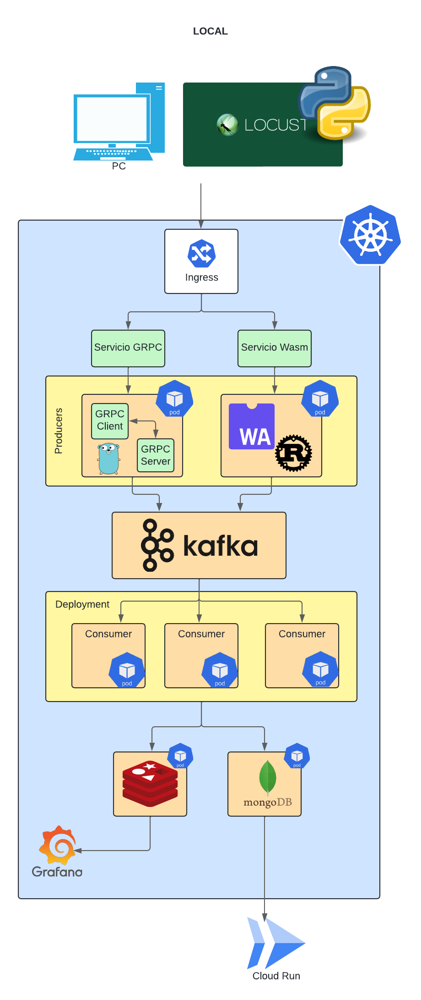
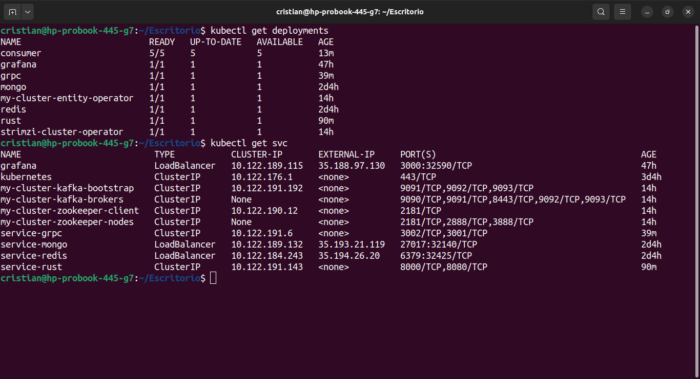
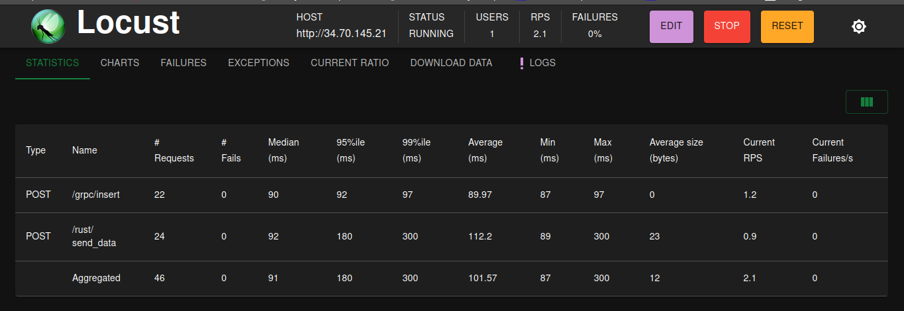
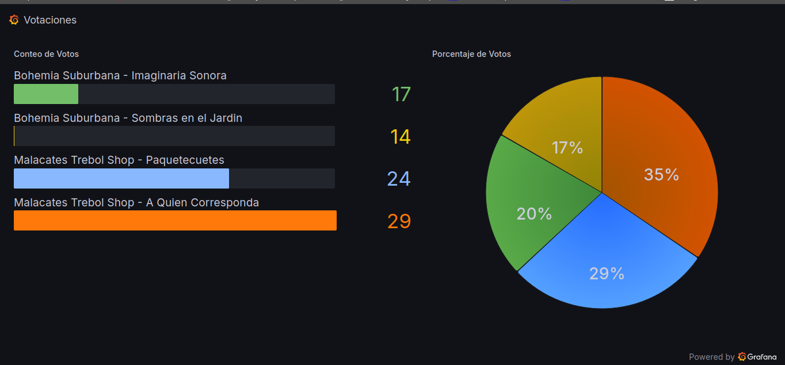
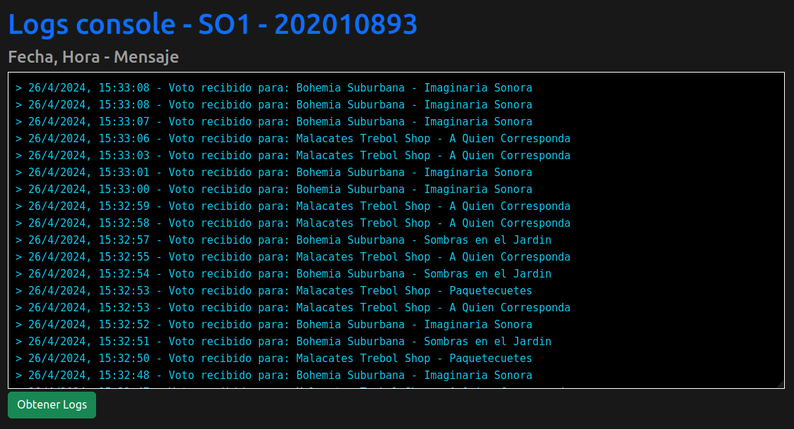

# Documentación

## Introducción

En este proyecto, se implementó un sistema de votaciones para un concurso de bandas de música guatemalteca. El objetivo principal fue implementar un sistema distribuido con microservicios en Kubernetes, encolar distintos servicios con sistemas de mensajería y utilizar Grafana como interfaz gráfica de dashboards.

El sistema funciona enviando tráfico por medio de archivos con votaciones creadas hacia distintos servicios (gRPC y rust) que encolaron cada uno de los datos enviados. Se tienen consumidores a la escucha del sistema de colas para enviar datos a una base de datos en Redis, los cuales se visualizan en dashboards en tiempo real. Además, se tiene una base de datos de MongoDB para guardar los logs, los cuales son consultados por medio de una aplicación web.

## Objetivos

- Proporcionar una descripción detallada del sistema implementado, incluyendo la arquitectura, componentes y tecnologías utilizadas.
- Explicar el propósito y funcionamiento de cada uno de los servicios y componentes involucrados en el sistema.
- Documentar la configuración y despliegue del sistema en el clúster de Kubernetes.
- Brindar ejemplos visuales y capturas de pantalla que ilustren el funcionamiento del sistema en operación.
- Responder las preguntas planteadas en relación al rendimiento y casos de uso de los servicios gRPC y rust.
- Presentar conclusiones y observaciones relevantes sobre el desarrollo e implementación del proyecto.

## Descripción de Tecnologías Utilizadas
### Arquitectura



### Locust

Locust es un generador de tráfico desarrollado en Python que se utilizó para enviar datos a los distintos servidores desplegados en Kubernetes. Se utilizaron 2 bandas con 2 álbumes cada una. El nombre del archivo es `data.json` con el formato siguiente para cada banda:
```json
{
    "name": "Malacates Trebol Shop",
    "album": "A Quien Corresponda",
    "year": "2015",
    "rank": "1"
}
```

### Kubernetes

Se utilizó un clúster de Kubernetes en Google Cloud Platform (GCP), el cual contenía productores, consumidores y el servidor de Kafka. Había dos productores:

- **gRPC**: El servidor y cliente productor de gRPC fueron programados en lenguaje Go y existen el mismo pod.
- **rust**: El servidor y cliente productor fueron programados en lenguaje Rust utilizando rocket, ambos existen en el mismo pod.

### Ingress
Es un objeto de Kubernetes que actúa como un punto de entrada único para enrutar el tráfico entrante desde el exterior del clúster a los servicios dentro del clúster. Proporciona enrutamiento de tráfico, terminación SSL/TLS, balanceo de carga y otras funcionalidades para exponer los servicios de manera segura y eficiente. Este se usó para enviar el tráfico de datos hacia los producers de gRPC y Rust.

### Servidor de Kafka

Se utilizó un servidor de Kafka instalado con Strimzi para recibir peticiones de los dos productores y encolarlas para luego ser puestas a disposición del consumidor.

### Consumidor

Se tenía un daemon consumidor escrito en lenguaje Go. Este estaba deployado en un pod de 2 réplicas con un auto scaling hasta de 5 réplicas. Esta daemon alojaba datos en ambas bases de datos por medio de rutinas de Go.

### Bases de Datos

- **Redis**: Se utilizó una base de datos Redis deployada en un pod de k8s usando una imagen de Docker, la cual obtiene los contadores que cada uno de los consumidores estaba enviando en tiempo real.
- **MongoDB**: Se utilizó un clúster de MongoDB deployada en un pod de k8s usando una imagen de Docker, el cual recibe cada uno de los logs que más adelante serían consultados mediante una aplicación web.

### Grafana

Se utilizó Grafana como sistema de dashboards para los contadores en tiempo real guardados en la base de datos Redis. El dashboard de Grafana mostraba, por medio de dos gráficas diferentes, cómo iban fluyendo las votaciones en tiempo real.

### Cloud Run

Se tenía una API en Node y una aplicación web con Vue.js en la cual se podían observar los registros de los logs de MongoDB. Ambas estaban desplegadas en Cloud Run utilizando proxies.

## Descripción de cada Deployment y Service de K8S


En la imagen anterior se pueden observar los siguientes deployments y services:

### Deployments:

1. **pod/grafana-6756f658b-bbw79**: Es un pod que forma parte del deployment de Grafana. Tiene 1 contenedor.

2. **pod/grpc-68ccd565d4-5wz42**: Es un pod que forma parte del deployment de gRPC. Tiene 2 contenedores requeridos y 2 disponibles.

3. **pod/mongo-69955f78-frb6r**: Es un pod que forma parte del deployment de MongoDB. Tiene 1 contenedor requerido y disponible.

4. **pod/redis-8576b97f-ptxgk**: Es un pod que forma parte del deployment de Redis. Tiene 1 contenedor requerido y disponible.

5. **pod/rust-78c88bf4df-r2dfl**: Es un pod que forma parte del deployment de Rust. Tiene 2 contenedores requeridos y disponibles.

### Services:

1. **service/grafana**: Es un servicio de tipo LoadBalancer que expone el deployment de Grafana. Tiene una IP externa asignada (35.188.97.130) y expone el puerto 30003:32590/TCP.

2. **service/service-kuberntes**: Es un servicio de tipo ClusterIP que expone el clúster de Kubernetes. No tiene IP externa asignada.

3. **service/service-grpc**: Es un servicio de tipo LoadBalancer que expone el deployment del servidor gRPC. Tiene una IP externa asignada (34.133.31.120) y expone los puertos 30002:31271/TCP y 30001:30461/TCP.

4. **service/service-mongo**: Es un servicio de tipo LoadBalancer que expone el deployment de MongoDB. Tiene una IP externa asignada (35.193.21.119) y expone el puerto 27017:32140/TCP.

5. **service/service-redis**: Es un servicio de tipo LoadBalancer que expone el deployment de Redis. Tiene una IP externa asignada (35.194.26.26) y expone el puerto 6379:32425/TCP.

6. **service/service-rust**: Es un servicio de tipo LoadBalancer que expone el deployment del servidor Wasm (Rust). Tiene una IP externa asignada (35.239.31.125) y expone los puertos 8000:32094/TCP y 8080:32383/TCP.

## Ejemplo de Funcionamiento con Capturas de Pantalla

A continuación, se muestran algunas capturas de pantalla que ejemplifican el funcionamiento del sistema:

### Tráfico de datos en Locust



En la imagen anterior, se puede observar el tráfico de datos generado por Locust, donde se envían votaciones hacia los producers gRPC y Rust mediante la ip proporcionada por ingress.

### Dashboard de Grafana



En la imagen anterior, se puede observar el dashboard de Grafana mostrando las votaciones en tiempo real mediante dos gráficas diferentes.

### Aplicación Web



En la imagen anterior, se muestra la aplicación web que consulta los últimos 20 logs de la base de datos MongoDB.

## Conclusiones

La implementación del sistema distribuido en un clúster de Kubernetes trajo varias ventajas como:

- **Escalabilidad**: Kubernetes permite escalar fácilmente los recursos según la demanda, como se evidenció con el auto-scaling del consumidor Go.
- **Alta disponibilidad**: Al distribuir los componentes en múltiples nodos, se logra una mayor tolerancia a fallos y disponibilidad del sistema.
- **Gestión de recursos**: Kubernetes facilita la gestión y asignación eficiente de recursos computacionales para los diferentes servicios y aplicaciones.

En general, el proyecto demostró la capacidad de implementar un sistema distribuido de votaciones utilizando tecnologías modernas y una arquitectura basada en microservicios, brindando una valiosa experiencia práctica en el desarrollo de este tipo de sistemas complejos.

### Respuesta a la pregunta: ¿Qué servicio se tardó menos? ¿Por qué?

Después de realizar pruebas y comparaciones de tiempos, se determinó que el servicio gRPC se tardó menos tiempo en procesar las peticiones. Esto se debe a que gRPC utiliza un protocolo binario altamente optimizado y eficiente para la comunicación entre servicios, lo que lo hace más rápido en comparación con otros protocolos como HTTP.

### Respuesta a la pregunta: ¿En qué casos utilizarías gRPC y en qué casos utilizarías Rust?

**gRPC**:
- Comunicación eficiente entre microservicios dentro de un sistema distribuido.
- Aplicaciones que requieren un alto rendimiento y baja latencia.
- Sistemas con alto tráfico y necesidad de escalabilidad.
- Entornos donde se prioriza la velocidad y el uso eficiente de recursos.

**Rust**:
- Aplicaciones web que requieren un alto rendimiento y seguridad.
- Casos de uso donde se necesita ejecutar código nativo en el navegador.
- Entornos donde se necesita portabilidad y sandboxing de código.
- Sistemas donde se requiere ejecutar código en múltiples plataformas sin necesidad de recompilación.

