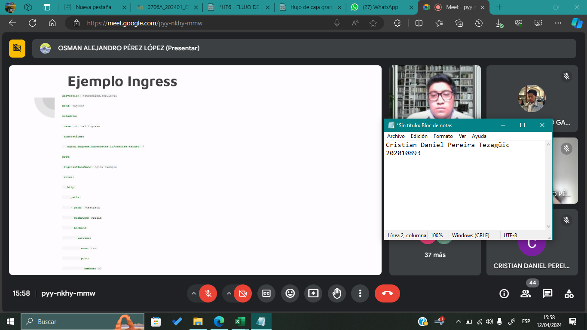
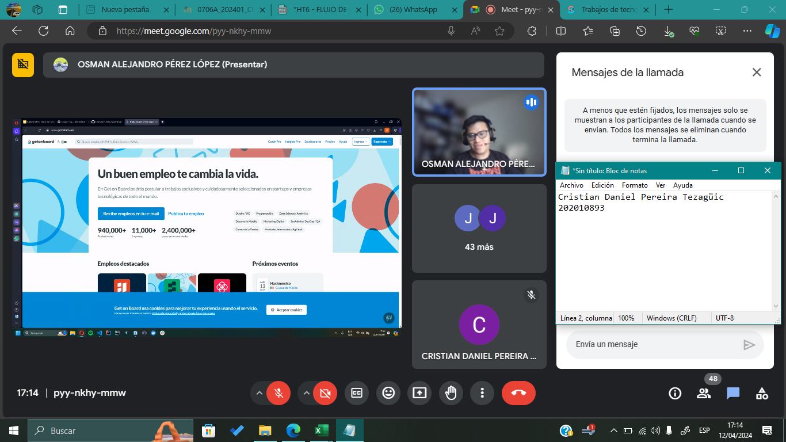

## Resumen/Ensayo sobre la Conferencia: "Kubernetes Tipos de Servicios y la Integración de Kafka con Strimzi"

El expositor comienza explicando los conceptos fundamentales de Kubernetes:

- **Pods**: La unidad más pequeña de computación en Kubernetes. Un pod es un proceso en ejecución dentro del clúster y puede contener uno o más contenedores. Se considera un pod como si fuera su propia máquina virtual ejecutando un proceso.

- **Deployments**: Un objeto que representa una aplicación dentro del clúster de Kubernetes. Define cómo se levantarán los pods replicados para esa aplicación. Permite especificar número de réplicas, imagen de contenedor a usar, puertos expuestos, variables de entorno, políticas de actualización de imagen, etc.

- **Servicios**: Describen cómo acceder a los conjuntos de pods que conforman una aplicación. Tipos:
    - **ClusterIP**: Asigna una IP interna del clúster para acceder a los pods solamente desde dentro del clúster.
    - **NodePort**: Mapea un puerto en cada nodo del clúster al puerto expuesto por los pods, permitiendo acceso desde fuera del clúster.
    - **LoadBalancer**: Asigna una IP pública a un balanceador de carga externo que enruta el tráfico a los pods.

- **Ingress**: Un objeto que permite enrutar el tráfico de entrada al clúster a los servicios basado en reglas definidas. Posibilita configurar routing, hosts virtuales, balanceo de carga, terminación SSL, etc. Requiere un Ingress Controller para funcionar.

Luego habla sobre Kafka, una plataforma distribuida para transmisión de datos en tiempo real:

- **Brokers**: Nodos que forman el clúster de Kafka. Almacenan y distribuyen los datos en particiones replicadas para alta disponibilidad.

- **Productores**: Apliciones cliente que envían mensajes/datos a un tópico específico de Kafka.

- **Consumidores** Aplicaciones cliente que suscriben y leen los mensajes de los tópicos a los que están suscritos.

- **Tópicos** Categorías o feeds de datos donde se ingieren los mensajes enviados por los productores.

Se demuestra cómo desplegar Kafka en un clúster de Kubernetes utilizando el operador Strimzi, el cual simplifica la instalación y configuración de Kafka. Muestra cómo crear tópicos, configurar consumidores y productores, conectarlos al clúster de Kafka. 

También cubre cómo exponer las aplicaciones usando el objeto Ingress y el Ingress Controller nginx.

Además, explica el autoescalado horizontal con HorizontalPodAutoscaler (HPA), configurando recursos de CPU/RAM y definiendo umbrales para escalar basado en uso.

Comparte consejos prácticos como limitar recursos en GCP, configurar clústeres, acceder a Kafka desde diferentes namespaces, etc.

En resumen, cubre conceptos clave de Kubernetes, detalles de Kafka y su integración en K8s con Strimzi, autoescalado y consejos prácticos.

## Capturas de pantalla de Asistencia

